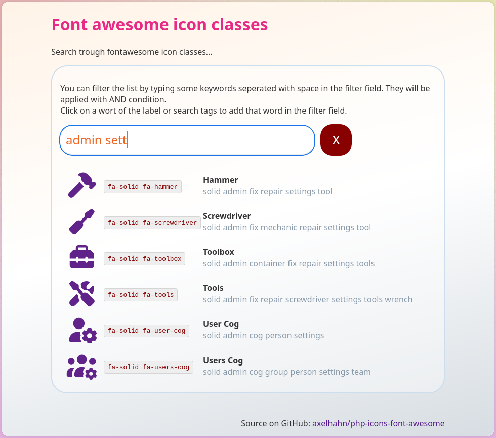

# Find icons of Font-awesome

Get a list of Font-awesome classes and showing its icons with simple search.

Free software and Open Source

👤 Author: Axel Hahn \
📄 Source: <https://github.com/axelhahn/php-icons-font-awesome> \
📜 License: GNU GPL 3.0

Related lnks:

* Font-awesome website: <https://fontawesome.com/>
* CDNJS - the cdn we load the icons from: <https://cdnjs.com/libraries/font-awesome>

## Description

This project is a search form for Font-awesome css classes to find an icon.

In the first run it fetches meta data from font-awesome and generates size reduced data files.

With php a table of all available font-awesome icon classes with title an its search terms is generated.

The table can be filtered by keywords.
Each word of label and search terms are linked to be added in the search field.




## Requirements

* PHP 8 (without web server)

## Usage

Start a builtin webserver of PHP with the following command:

```txt
php -S localhost:9000
```

Then open in your webbrowser: <http://localhost:9000>

In the search field type some keywords and click on a word of the label or search tags to add that word in the filter field. All keywords will be applied with AND condition. 
